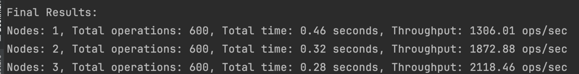

# Key-Value Store Project

## Project Overview
This project implements a simple single-server **key-value store** using Flask. The server supports basic operations like `GET`, `PUT`, and `DELETE` to manage key-value pairs. The system ensures **thread safety** for concurrent operations by using per-key locks and includes a **persistence mechanism** that periodically saves in-memory data to disk to prevent data loss. Additionally, the project features **operation logging** for monitoring and debugging.
## Update(2024 11.25)
Updates
### 1. Optimized Benchmark Script
Integrated delete operation into the benchmark script to test all basic operations (set, get, delete) comprehensively.
Modified the script to:
Test 1-node, 2-node, and 3-node KV Store setups in a single run.
```python
import asyncio
import aiohttp
import time
from itertools import cycle

# Configurations for testing distributed KV stores
BASE_URLS_LISTS = [
    ['http://127.0.0.1:8081'],  # Single node
    ['http://127.0.0.1:8081', 'http://127.0.0.1:8082'],  # Two nodes
    ['http://127.0.0.1:8081', 'http://127.0.0.1:8082', 'http://127.0.0.1:8083']  # Three nodes
]

# Total operations and concurrency settings
NUM_OPERATIONS = 600  # Total operations (split between set, get, delete)
CONCURRENCY = 250     # Number of concurrent operations

# Queue for latencies to calculate performance
latencies = []

# Single KV store operation (async)
async def kv_store_operation(session, op_type, key, value=None, node_iterator=None):
    try:
        base_url = next(node_iterator)  # Use round-robin to pick a node
        start_time = time.time()  # Start timing

        if op_type == 'set':
            async with session.post(f"{base_url}/{key}", json={'value': value}) as response:
                await response.text()
        elif op_type == 'get':
            async with session.get(f"{base_url}/{key}") as response:
                await response.text()
        elif op_type == 'delete':
            async with session.delete(f"{base_url}/{key}") as response:
                await response.text()

        latency = time.time() - start_time  # Calculate latency
        latencies.append(latency)  # Store latency
    except Exception as e:
        pass  # Ignore errors for maximum throughput

# Worker coroutine function
async def worker(operations, base_urls):
    node_iterator = cycle(base_urls)  # Create a round-robin iterator for nodes
    async with aiohttp.ClientSession() as session:
        tasks = [kv_store_operation(session, op, key, value, node_iterator) for op, key, value in operations]
        await asyncio.gather(*tasks)  # Concurrent execution

# Main benchmark function
async def test_kv_store(base_urls, num_operations, concurrency):
    # Prepare operations: 1/3 'set', 1/3 'get', 1/3 'delete'
    operations = []
    for i in range(num_operations // 3):
        operations.append(('set', f'key_{i}', f'value_{i}'))
    for i in range(num_operations // 3):
        operations.append(('get', f'key_{i}', None))
    for i in range(num_operations // 3):
        operations.append(('delete', f'key_{i}', None))

    # Divide operations into batches for concurrent execution
    operation_batches = [operations[i:i + concurrency] for i in range(0, len(operations), concurrency)]

    # Start benchmark
    start_time = time.time()
    for batch in operation_batches:
        await worker(batch, base_urls)
    total_time = time.time() - start_time

    # Calculate final results
    total_ops = num_operations
    throughput = total_ops / total_time
    return total_ops, total_time, throughput

# Main program
async def main():
    results = []
    for base_urls in BASE_URLS_LISTS:
        total_ops, total_time, throughput = await test_kv_store(base_urls, NUM_OPERATIONS, CONCURRENCY)
        results.append((len(base_urls), total_ops, total_time, throughput))

    # Print final results
    print("\nFinal Results:")
    for num_nodes, total_ops, total_time, throughput in results:
        print(f"Nodes: {num_nodes}, Total operations: {total_ops}, Total time: {total_time:.2f} seconds, "
              f"Throughput: {throughput:.2f} ops/sec")

if __name__ == '__main__':
    asyncio.run(main())

```

### 2. Docker Updates
Adjusted docker-compose.yml:
Three KV Store instances were configured on ports 8081, 8082, and 8083.

### 3. Nginx Updates
Configured Nginx as the reverse proxy for the KV Store cluster:
Set up load balancing using round-robin between 8081, 8082, and 8083.
### 4. Performance Testing
Conducted extensive performance benchmarks:
Nodes: 1, 2, and 3 configurations tested sequentially.
Results:
1 Node: ~1100 ops/sec.
2 Nodes: ~1700 ops/sec.
3 Nodes: ~2000 ops/sec.


## Update(2024 11.9)


This project has been enhanced to support consistent hashing for distributing the load across multiple instances. Three containerized key-value store instances have been deployed using Docker, each listening on a unique port (8081, 8082, 8083). The updated implementation improves scalability and performance, reducing latency and increasing throughput as more instances are added. Benchmark results and testing details are provided in the updated documentation.
## Features
- **API operations**: Supports `GET`, `PUT`, and `DELETE` requests for key-value storage management.
- **Thread safety**: Implements per-key locks to ensure concurrent requests do not conflict.
- **Persistence**: Periodically saves the in-memory data to disk every 60 seconds to ensure data durability.
- **Logging**: Logs all operations, including `GET`, `PUT`, `DELETE` actions, and data persistence.

## Installation

### Prerequisites
- Python 3.x
- `pip` (Python package installer)
- Docker (for containerized deployment)

### Steps
1. Clone the repository:
   ```bash
   git clone https://github.com/your-repo/key-value-store.git
   cd key-value-store
   ```
2. Set up a virtual environment (optional but recommended):
    ```bash
    python3 -m venv .venv
    source .venv/bin/activate
    
    ```
3. Install the dependencies:
   ```bash
   pip install -r requirements.txt

   ```
   
4. Run the Flask server:
   ```bash
   python main.py
   ```
   
   
### API Usage(Using Postman( Interface test software) as clients)
1. PUT - Store a key-value pair

```bash
URL: http://127.0.0.1:8080/<key>
Method: POST
Body (JSON):
{
  "value": "your_value"
}

#response(200 OK)

{
  "message": "Value stored successfully"
}

```


2. GET - Retrieve a value by key
```bash
URL: http://127.0.0.1:8080/<key>
Method: GET
Response (200 OK):

{
  "value": "your_value"
}

#Response if key not found (404 Not Found):

{
  "error": "Key not found"
}

```


3. DELETE - Remove a key-value pair

```bash
URL: http://127.0.0.1:8080/<key>
Method: DELETE
Response (200 OK):

{
  "message": "Key deleted successfully"
}

#Response if key not found (404 Not Found):
{
  "error": "Key not found"
}


```


### Logging
All operations (GET, PUT, DELETE, and periodic saves) are logged in kv_store.log.
```bash
2024-10-07 14:05:10 - SAVE: Periodic save to disk.
2024-10-07 14:07:10 - PUT - Key: key_1, Value: value_1
2024-10-07 14:08:10 - GET - Key: key_1

```

### Persistence
Data is periodically saved to disk in a file named kv_store.json every 15 seconds. This ensures that key-value pairs remain available even after a server restart.
Upon server startup, the data is loaded from kv_store.json back into memory.

### Benchmark Test
```bash
running main.py

#open terminal
python benchmark.py

Final Results:
Total operations: 600
Total time: 0.38 seconds
Throughput: 1569.28 operations per second
Average Latency: 0.00380 seconds per operation


```
## Docker
```bash
# 1.Create image
docker build -t kv_store_app .

# 2. Running server on docker
docker run -p 8080:8080 kv_store_app

# 3.Now, the application is accessible at http://localhost:8080 on your host machine.


```
## Docker Deployment
```markdown
# 1. Build the image
docker build -t kv_store_app .

# 2. Deploy three instances of the KV store with unique ports
docker run -p 8081:8080 kv_store_app
docker run -p 8082:8080 kv_store_app
docker run -p 8083:8080 kv_store_app

# 3. Now, the instances are accessible at:
# Instance 1: http://localhost:8081
# Instance 2: http://localhost:8082
# Instance 3: http://localhost:8083

```

## Project Structure
```markdown
.
├── kv_store_demo1/
│   ├── __init__.py            # Marks the folder as a Python package
│   ├── benchmark.py           # Script to test performance metrics (throughput and latency)
│   ├── docker-compose.yml     # Docker Compose configuration for running multiple KV store instances
│   ├── Dockerfile             # Dockerfile for containerizing the KV store application
│   ├── kv_store.json          # File where key-value data is saved (created after running the app)
│   ├── kv_store.log           # Log file recording all operations
│   ├── load_balancer.py       # Implements consistent hashing and distributes requests across KV store instances
│   ├── logging_utils.py       # Utility module for logging operations
│   ├── main.py                # Entry point to start the server
│   ├── persistence.py         # Handles data persistence (saving/loading)
│   ├── README.md              # Project documentation
│   ├── requirements.txt       # Dependencies for the project
│   ├── server.py              # Implements Flask server for handling key-value operations
```

